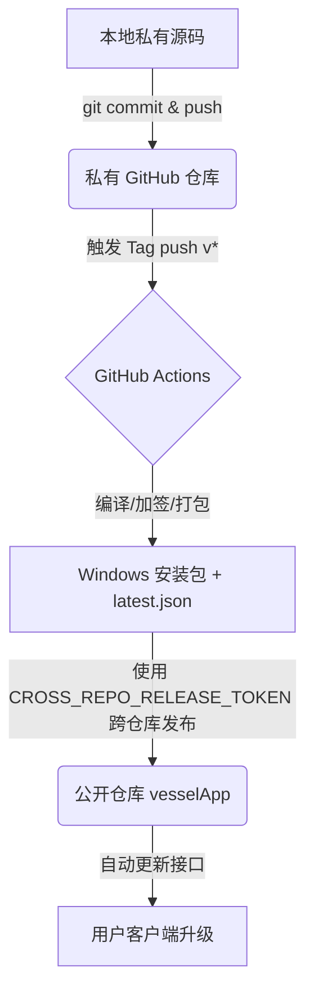

# Vessel 跨仓库打包与自动发布 (方案 A) 操作全流程指南

本指南详细介绍如何将存储在 **私有源码仓库** 中的 Vessel 源码，通过 GitHub Actions 自动编译、自动签名加签，并跨仓库发布到 **公开的应用分发仓库** (`mangerle/vesselApp`) 的 Release 中。

通过此方案，外界只能看到您公开仓库里的打包文件和更新元数据，而您的源码将 100% 保持私密与安全。

---

## 整体发布架构



---

## 全流程操作步骤

### 第一步：准备公开应用仓库
1. 确认已创建公开的仓库：`https://github.com/mangerle/vesselApp`。
2. 此仓库用于托管最终打包好的 `.msi` 安装包、签名校验文件 `.sig` 以及升级版本引导文件 `latest.json`。该仓库无需存放任何源代码。

### 第二步：在个人 GitHub 账户中生成跨仓库 PAT (个人访问令牌)
因为私有仓库的 Actions 需要拥有向公开仓库 `vesselApp` 写入 Release 的权限，您需要为其配置一个有权限的 Access Token：
1. 登录 GitHub 网页端，点击右上角头像 -> 选择 **Settings**。
2. 滚动左侧菜单到最下方，选择 **Developer settings**。
3. 在左侧选择 **Personal access tokens** -> **Tokens (classic)**。
4. 点击右上角 **Generate new token** -> 选择 **Generate new token (classic)**。
5. 配置以下属性：
   - **Note (名称)**：例如 `vessel-cross-repo-release`
   - **Expiration (有效期)**：建议选择 **No expiration** (永不过期) 以免影响后续自动构建。
   - **Select scopes (权限范围)**：勾选 **`public_repo`** 即可。
6. 点击最下方的 **Generate token**，**立即复制生成的 `ghp_` 开头的长字符串**并妥善保存（刷新页面后将无法再次查看）。

### 第三步：本地生成 Tauri 签名密钥对 (用于更新加签)
Tauri 的安全更新机制要求所有的安装包必须经过私钥数字签名，客户端再通过公钥进行验签，防止升级包被劫持篡改。
1. 在本地项目根目录 `d:\coding\rust\vessel` 下打开终端。
2. 运行免密密钥对生成命令：
   ```bash
   npx tauri signer generate --ci
   ```
3. 终端会直接打印出生成好的密钥对：
   - **`Public key` (公钥)**：较短的字符串，用于客户端验签。
   - **`Private key` (私钥)**：较长的字符串，用于打包时签名。
4. **配置公钥到项目**：
   复制输出的 `Public key`，打开项目中的 [tauri.conf.json](file:///d:/coding/rust/vessel/src-tauri/tauri.conf.json)，填入或替换第 40 行的 `pubkey` 的值：
   ```json
   "plugins": {
     "updater": {
       "endpoints": [
         "https://github.com/mangerle/vesselApp/releases/latest/download/latest.json"
       ],
       "pubkey": "您的公钥字符串"
     }
   }
   ```
   *修改完毕后，请提交代码。*

### 第四步：在私有源码仓库中配置 Secrets (密钥托管)
为了在 Actions 运行期间安全调用私钥和跨仓库 Token，必须在私有源码仓库中注册 Actions Secrets：
1. 打开您的 **私有源码 GitHub 仓库**。
2. 依次进入 **Settings** -> **Secrets and variables** -> **Actions**。
3. 点击 **New repository secret** 按钮，分别添加以下两个机密项：
   - **`CROSS_REPO_RELEASE_TOKEN`**：填入第二步中生成的 **PAT (ghp_...)**。
   - **`TAURI_SIGNING_PRIVATE_KEY`**：填入第三步中生成的 **私钥 (Private key)** 字符串。
   - *(注：若在生成密钥时您设置了私钥密码，则还需要新建一个 `TAURI_SIGNING_PRIVATE_KEY_PASSWORD` 填入密码，若未设密码则无需此项)*。

---

## 🛠️ 触发打包发布流程 (每次版本迭代)

当您开发完新功能并准备发布新版本时，请执行以下标准操作：

### 1. 保持版本号三合一一致
发布前，请务必确认以下三个文件中的版本号是一致的（例如准备发布 `0.1.2` 版本）：
- [package.json](file:///d:/coding/rust/vessel/package.json) 中的 `"version": "0.1.2"`
- [tauri.conf.json](file:///d:/coding/rust/vessel/src-tauri/tauri.conf.json) 中的 `"version": "0.1.2"`
- [Cargo.toml](file:///d:/coding/rust/vessel/src-tauri/Cargo.toml) 中的 `version = "0.1.2"`

### 2. 提交代码至 master 分支
确保本地的所有修改均已提交，并且推送到远程默认分支：
```bash
git add .
git commit -m "feat: 迭代新版本 0.1.2"
git push origin master
```

### 3. 创建并推送版本 Tag
在本地终端基于当前提交打上 `v` 开头的 Tag 并推送到远程，**这是触发自动构建的唯一开关**：
```bash
# 打上 v0.1.2 的版本标签
git tag v0.1.2

# 将此标签推送到私有源码仓库
git push origin v0.1.2
```

### 4. 观察云端构建与自动发布
- 推送 Tag 后，打开您私有源码仓库的 **Actions** 选项卡，会看到一个名为 `自动加签发布 Release` 的工作流正在运行。
- 该工作流会拉取 Node.js 与 Rust 环境，编译生成 Windows MSI 安装包并使用您配置的 `TAURI_SIGNING_PRIVATE_KEY` 进行加签。
- 构建成功后，工作流将通过 `CROSS_REPO_RELEASE_TOKEN` 跨仓库将编译出的 `.msi`、`.sig` 和更新描述文件 `latest.json` 自动推送到公开仓库 `mangerle/vesselApp` 对应版本的 Releases 中。

---

## 🔄 客户端更新侦测逻辑

在发布成功后，客户端的关于面板会自动检测更新：
1. 前端通过 [Settings.vue](file:///d:/coding/rust/vessel/src/views/Settings.vue) 中的真实 `check()` API，去拉取公开仓库 `mangerle/vesselApp` 的 `latest.json` 文件。
2. 校验 `latest.json` 中的 `version` 是否大于当前版本（例如 `v0.1.2` 是否大于 `v0.1.1`）。
3. 校验通过后，使用公钥比对云端签名，安全地拉取安装包进行后台静默解压和覆盖安装。
4. 安装完成后，为用户呈现“立即重启应用”按钮，点击后调用 `relaunch()` 重启软件即完成热更新。
